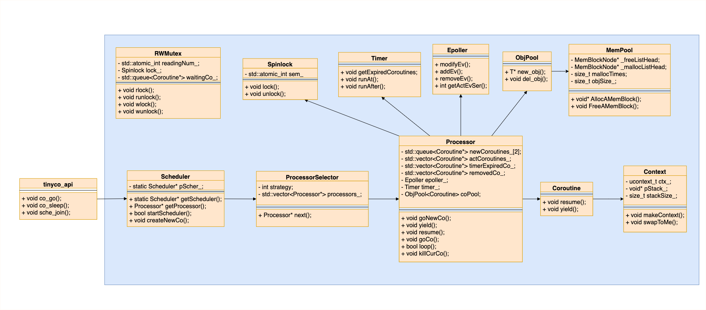

# tinyco 协程库

## ucontext 

在类 System V 环境中,在头文件 `<ucontext.h>`  中定义了两个结构类型 `mcontext_t` 和 `ucontext_t` 和四个函数`getcontext(), setcontext(), makecontext(), swapcontext()` 利用它们可以在一个进程中实现用户级的线程切换。

`ucontext` 结构体：

```c++
typedef struct ucontext {
	struct ucontext *uc_link;		
	sigset_t         uc_sigmask;	
	stack_t          uc_stack;
	mcontext_t       uc_mcontext;	
	...
} ucontext_t;
```

参数：

- `uc_link`：当前 context 执行结束后要执行的下一个 context,如果为空,执行完当前 context 之后退出程序；
- `uc_sigmask`：该上下文中的要阻塞的信号集合；
- `uc_stack`：当前 context 运行的栈信息
    - `ss_sp`：指定栈空间
    - `ss_size`：指定栈空间大小
- `uc_mcontext`：保存具体的程序执行上下文,如PC值、堆栈指针以及寄存器等信息,实现依赖于底层,是平台硬件相关的

当前上下文运行终止时会恢复 `uc_link` 指向的上下文。

**四个函数：**

```c++
int getcontext(ucontext_t *ucp);
```

 初始化 ucp 结构体，将当前的上下文保存到 ucp 中，以便后续的恢复上下文。

```c++
int setcontext(const ucontext_t *ucp);
```

`setcontext()` 恢复用户上下文为 `ucp`，`setcontext()` 的上下文 ucp 通过 `getcontext()` 或 `makecontext()` 取得，如果调用成功则不返回。

通过 `getcontext()` 取得，切换到该上下文，程序的执行在 `getcontext()` 后继续执行；

通过 `makecontext()` 取得，会调用 `makecontext()` 第二参数中指向的函数，该函数返回时，继续传入 `makecontext()` 中第一个参数上下文中的 `uc_link` 指向的上下文，如果是 NULL，程序结束。

```c++
void makecontext(ucontext_t *ucp, void (*func)(void), int argc, ...);
```

`makecontext()` 修改 `ucp` 所指向的上下文，`ucp` 是被 `getcontext()` 所初始化的上下文，当这个上下文采用 `swapcontext()` 或者 `setcontext()` 被恢复，程序的执行会切换到 `func()` 调用，通过 `makecontext()` 调用的 `argc` 传递 `func` 的参数，`makecontext()` 产生一个调用前，应确保栈空间已经进行了分配，设置后继的上下文 `ucp->uc_link` (**不设置后继上下文，不能实现切换**)。

当上下文通过 `setcontext` 或者 `swapcontext` 激活后，执行 `func` 函数，`argc` 为 `func` 的参数个数，后面是 `func` 的参数序列。当 `func` 执行返回后，继承的上下文被激活，如果继承上下文为 NULL 时，线程退出。

```cpp
int swapcontext(ucontext_t *oucp, ucontext_t *ucp);
```

保存当前上下文到 oucp 结构体中，然后激活 upc 上下文

**使用 `ucontext` 函数簇实现用户线程（即协程）**

- 我们首先调用 `getcontext` 获得当前上下文；
- 修改当前上下文 `ucontext_t` 来指定新的上下文，如指定栈空间及其大小，设置用户线程执行完后返回的后继上下文（即主函数的上下文）等；
- 调用 `makecontext` 创建上下文，并指定用户线程中要执行的函数；
- 切换到用户线程上下文去执行用户线程（如果设置的后继上下文为主函数，则用户线程执行完后会自动返回主函数）。

使用示例：

```c
#include <stdio.h>
#include <ucontext.h>

static ucontext_t ctx[3];

static void f1(void) {
    puts("start f1");
    swapcontext(&ctx[1], &ctx[2]);
    puts("finish f1");
}

static void f2(void) {
    puts("start f2");
    swapcontext(&ctx[2], &ctx[1]);
    puts("finish f2");
}

int main(void) {
    char st1[8192];
    char st2[8192];

    getcontext(&ctx[1]);
    ctx[1].uc_stack.ss_sp = st1;
    ctx[1].uc_stack.ss_size = sizeof st1;
    ctx[1].uc_link = &ctx[0];
    makecontext(&ctx[1], f1, 0);

    getcontext(&ctx[2]);
    ctx[2].uc_stack.ss_sp = st2;
    ctx[2].uc_stack.ss_size = sizeof st2;
    ctx[2].uc_link = &ctx[1];
    makecontext(&ctx[2], f2, 0);
    
    puts("main");
    swapcontext(&ctx[0], &ctx[2]);
    return 0;
}
```

## tinyco 框架

框架：


根据计算机的核心数开对应的线程数运行协程，其中每一个线程对应一个 Processor 实例，协程 Coroutine 实例运行在 Processor 的主循环中，Processor 使用 epoller 和定时器 timer 进行任务调度。而 Scheduler 则并不存在一个循环，它是一个全局单例，当某个线程中调用 `co_go()` 运行一个新协程后，实际会调用该实例的方法，选择一个协程最少的 Processor 接管新的协程，也可以指定具体某一个 Processor 来接管新的协程。

类图：



### context

context 类封装了 ucontext 上下文切换的操作，其他需要使用上下文切换的地方都使用 context 类，目的是将来想使用其他库的上下文切换方法是，只需要实现该类中的方法即可，主要实现了四个方法。

```c++
//函数指针设置当前context的上下文入口
void makeContext(void (*func)(), Processor*, Context*);

//直接用当前程序状态设置当前context的上下文
void makeCurContext();

//将当前上下文保存到oldCtx中，然后切换到当前上下文，若oldCtx为空，则直接运行
void swapToMe(Context* pOldCtx);

//获取当前上下文的ucontext_t指针
inline struct ucontext_t* getUCtx() { return &ctx_; };
```

### Coroutine

协程对象，主要实现协程的几个关键方法：`resume()`，`yield()`，但真正的 `yield` 由 Processor 执行，这里的 `yield` 只是修改当前协程的状态方便在 Processor 中执行。

### MemPool ObjPool

对象池主要用于创建 coroutine 实例上，对象池每次创建对象时，会先从**内存池**中取出相应大小的块，内存池与对象大小强相关的，有一个空闲链表，每次分配空间都从空间链表中取，如果空闲链表没有内容，首先会分配 `(分配次数+40)*对象大小` 的空间，然后分成一个个的块，挂到空闲链表上，这里空闲链表节点没有使用额外的空间：效仿的 stl 的二级配置器中的方法，将数据和 `next` 指针放在了一个 `union` 中。从内存池取出所需内存块后，会判断对象是否拥有 non-trivial （显式定义默认构造、拷贝构造、... ）构造函数，没有的话直接返回，有的话使用 $placement\ new$ 构造对象。

### Epoller

功能有两个：

- 监视 epoll 中是否有事件发生；
- 向 epoll 中添加、修改、删除监视的 fd。值得注意的是，该类并不存储任何协程对象实体，也不维护任何协程对象实体的生命期，使用的是 LT。

初始 `vector` 长度设置为 16。

`epoll_create1()` 设置 `EPOLL_CLOEXEC`

原因：

子进程以写时复制（Copy-On-Write）方式获得父进程的数据空间、堆和栈副本，这其中也包括文件描述符。刚刚fork 成功时，父子进程中相同的文件描述符指向系统文件表中的同一项（这也意味着他们共享同一文件偏移量）。设置后这样进行 `fork()` 后子进程不能使用父进程中的 fd，父进程可以正常使用，进程替换时会自动关闭文件描述符。

### Timer

定时器主要使用的 Linux 的 `timerfd_create` 创建的时钟 fd 配合一个优先队列（小根堆）实现的，原因是要求效率而没有移除协程的需求。小根堆中存放的是时间和协程对象的 pair：`std::priority_queue<std::pair<Time, Coroutine*>`。

```c++
//获取所有已经超时的需要执行的函数
void getExpiredCoroutines(std::vector<Coroutine*>& expiredCoroutines);
//在time时刻需要恢复协程pCo
void runAt(Time time, Coroutine* pCo);
//经过time毫秒恢复协程pCo
void runAfter(Time time, Coroutine* pCo);
void wakeUp();
//给timefd重新设置时间，time是绝对时间
bool resetTimeOfTimefd(Time time);
```

首先，初始化一个 `timefd_create` 一个 timefd，然后将它放入 epoll 中，如果调用 `runAt` 或 `runAfter` 时，先把新来的任务插入到小根堆中，判断是否是最近的任务，是的话调用 `resetTimeOfTimefd` 来更新时间，如果出现超时，`epoll_wait()` 会跳出阻塞，在 Processor 的主循环中首先处理的就是超时事件，方法就是与当前时间对比并取出小根堆中的协程，直到小根堆中所有任务的时间都比当前大，另外，取出来的协程会放在一个数组中，用于在 Processor 循环中执行。

定时器还有另外一个功能，就是唤醒 `epoll_wait()`，当有新的协程加入时，实际就是通过定时器来唤醒的 processor 主循环，并执行新接受的协程。

### Processor

一个 Processor 在 netco 就对应一个线程，Processor 负责存放协程 Coroutine 实体并管理其生命周期，协程运行在 Processor 的主循环上，Processor 使用 Epoller 和 Timer 进行任务调度。

其成员如下：

```cpp
std::queue<Coroutine*> newCoroutines_[2];
// newCoroutines_为双缓冲队列，一个队列存放新来的协程，另一个给Processor主循环用于执行新来的协程，执行完后就交换队列，每加入一个新的协程就会唤醒一次Processor主循环，以立即执行新来的协程。

std::vector<Coroutine*> actCoroutines_;
// 存放EventEpoller发现的活跃事件的队列，当epoll_wait被激活时，Processor主循环会尝试从Epoller中获取活跃的协程，存放在actCoroutine_队列中，然后依次恢复执行。

std::vector<Coroutine*> timerExpiredCo_;
// 存放超时的协程队列，当epoll_wait被激活时，Processor主循环会首先尝试从Timer中获取活跃的协程，存放在timerExpiredCo队列中，然后依次恢复执行。

std::vector<Coroutine*> removedCo_;
// 存放被移除的协程列表，要移除某一个事件会先放在该列表中，一次循环结束才会真正delete
```

执行顺序：

执行超时的协程(`timerExpiredCo_`) ---> 执行新来的协程(`newCoroutines_`) ---> 执行 epoller 中被激活的协程(`actCoroutines_`) ----> 清理 `removerdCo_` 中的协程。

### Scheduler

调度器，指协程应该运行在哪个 Processor 上，netco 中的该类为全局单例，所执行的调度也相对比较简单，其可以让用户指定协程运行在某个 Processor 上，若用户没有指定，则挑选协程数量最少的 Processor 接管新的协程。

在 libgo 和 Golang 中，scheduler 还有一个 steal 的操作，可以将一个协程从一个 Processor 中偷到另一个 Processor 中，因为其 Processor 的主循环是允许阻塞的，并且协程的运行完全由库决定。而 netco 可以让用户指定某个协程一直运行在某个 Processor 上。

### tinyco_api

像 Golang 一样将 Scheduler 进一步地封装成了函数接口而不是一个对象，所以只需要包含 tinyco_api.h，即可调用 tinyco 函数风格的协程接口，而无需关心任何库中的对象。

### RWMutex

RWMutex 是用于协程同步的读写锁，读锁互相不互斥而与写锁互斥，写锁与其它的均互斥。原理是类中维护了一个队列，若互斥了则将当前协程放入队列中等待另一协程解锁时的唤醒。

## 运行

```shell
mkdir bulid && cd bulid
cmake ..
make
```

## example

编译后在 bin 文件夹下，可以直接运行

## 参考

@YukangLiu https://github.com/YukangLiu/netco